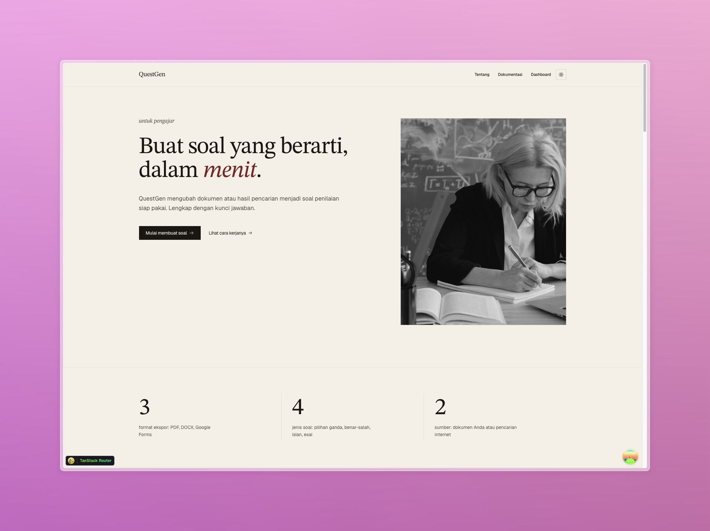

# QuestGen



AI-powered question generator for educators. Upload documents or search the web, configure parameters, and generate assessment questions with answer keys — ready to export as PDF, DOCX, or Google Forms.

## Features

- **AI Question Generation** — Generate multiple choice, true/false, fill-in-the-blank, and essay questions from documents or web search
- **Streaming Generation** — Questions appear one-by-one as they are generated; close the tab and the process continues on the server
- **Document Upload** — PDF and DOCX support with indexed chunking for traceable source references
- **Web Search** — Tavily-powered search as an alternative source
- **Export Options** — PDF, DOCX, and Google Forms export
- **Session History** — All question sets are saved, editable, and reusable
- **TanStack Router** — File-based routing with full type safety
- **TailwindCSS** — Utility-first CSS for rapid UI development
- **Shared UI Package** — shadcn/ui primitives live in `packages/ui`
- **Hono** — Lightweight server framework running on Cloudflare Workers
- **Drizzle ORM** — TypeScript-first ORM with PostgreSQL
- **ChromaDB** — Vector database for document embeddings and retrieval
- **Biome** — Linting and formatting

## Project Structure

```
questgen/
├── apps/
│   ├── web/              # Frontend application (React + TanStack Router + Vite)
│   └── server/           # Backend API (Hono + Cloudflare Workers)
├── packages/
│   ├── ui/               # Shared shadcn/ui components and styles
│   ├── db/               # Database schema, Drizzle config, and queries
│   ├── env/              # Environment variable validation (@t3-oss/env-core)
│   └── config/           # Shared TypeScript configuration
```

## Environment Variables

### Web (`apps/web/.env`)

| Variable | Description |
|----------|-------------|
| `VITE_SERVER_URL` | URL of the backend API server (e.g., `http://localhost:3000`) |

### Server (`apps/server/.env`)

**Required for local development:**

| Variable | Description |
|----------|-------------|
| `DATABASE_URL` | PostgreSQL connection string |
| `JWT_SECRET` | Secret key for signing JWT tokens |
| `CORS_ORIGIN` | Allowed CORS origin for the web app (e.g., `http://localhost:3001`) |
| `SERVER_URL` | Public URL of the server (e.g., `http://localhost:3000`) |
| `OPENROUTER_API_KEY` | API key for OpenRouter (LLM provider) |
| `MISTRAL_API_KEY` | API key for Mistral AI (embedding model) |
| `TAVILY_API_KEY` | API key for Tavily (web search) |
| `CHROMA_TENANT` | ChromaDB tenant name |
| `CHROMA_DATABASE` | ChromaDB database name |

**Optional:**

| Variable | Description |
|----------|-------------|
| `CHROMA_URL` | ChromaDB server URL (local dev) |
| `CHROMA_API_KEY` | ChromaDB API key (cloud/production) |
| `R2_PUBLIC_HOST` | Public host for R2 bucket files |
| `LANGFUSE_PUBLIC_KEY` | Langfuse public key for observability |
| `LANGFUSE_SECRET_KEY` | Langfuse secret key for observability |
| `LANGFUSE_BASE_URL` | Langfuse base URL (defaults to cloud) |

> **Production:** Secrets (`DATABASE_URL`, `JWT_SECRET`, API keys) should be set via `wrangler secret put`. Bindings (`DOCUMENTS_BUCKET`, `DOC_QUEUE`) are configured in `wrangler.jsonc`.

## Getting Started

### Prerequisites

- **Node.js** with pnpm
- **PostgreSQL** database running locally or remotely
- **ChromaDB** running locally (for vector storage) or cloud access

### Install Dependencies

```bash
pnpm install
```

### Database Setup

1. Ensure your PostgreSQL database is running.
2. Update `apps/server/.env` with your `DATABASE_URL`.
3. Push the schema to the database:

```bash
pnpm run db:push
```

### Start Development

```bash
pnpm run dev
```

- Web app: [http://localhost:3001](http://localhost:3001)
- API server: [http://localhost:3000](http://localhost:3000)

### Start Individual Apps

```bash
pnpm run dev:web      # Frontend only
pnpm run dev:server   # Backend only
```

## UI Customization

React web apps share shadcn/ui primitives through `packages/ui`.

- Change design tokens and global styles in `packages/ui/src/styles/globals.css`
- Update shared primitives in `packages/ui/src/components/*`
- Adjust shadcn aliases or style config in `packages/ui/components.json` and `apps/web/components.json`

### Add Shared Components

```bash
npx shadcn@latest add accordion dialog popover sheet table -c packages/ui
```

Import shared components:

```tsx
import { Button } from "@questgen/ui/components/button";
```

## Deployment (Cloudflare)

- Deploy: `pnpm run deploy`
- The server is a Cloudflare Worker with R2, Queues, and D1/PostgreSQL bindings

## Git Hooks and Formatting

```bash
pnpm run check   # Format and lint fix with Biome
```

## Available Scripts

- `pnpm run dev` — Start all applications in development mode
- `pnpm run dev:web` — Start only the web application
- `pnpm run dev:server` — Start only the server
- `pnpm run build` — Build all applications
- `pnpm run check-types` — Check TypeScript types across all apps
- `pnpm run db:push` — Push schema changes to database
- `pnpm run db:generate` — Generate database client/types
- `pnpm run db:migrate` — Run database migrations
- `pnpm run db:studio` — Open Drizzle Studio UI
- `pnpm run check` — Run Biome formatting and linting
- `pnpm run deploy` — Deploy the server to Cloudflare Workers

## TODO

- [ ] Update question
- [ ] Delete question
- [ ] Export questions to:
  - [ ] PDF
  - [ ] DOCX
  - [ ] Google Forms
